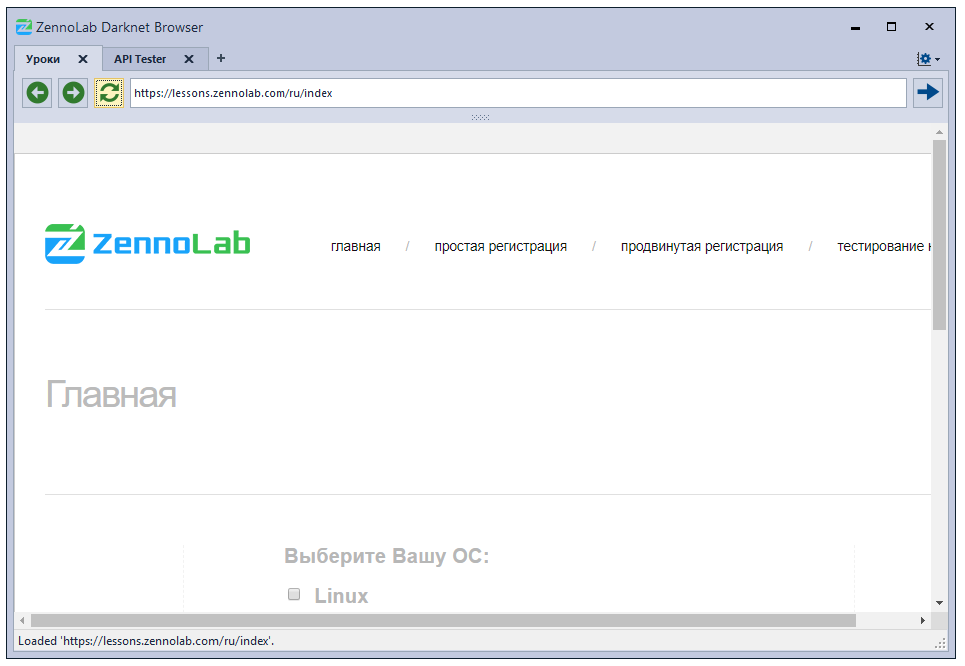
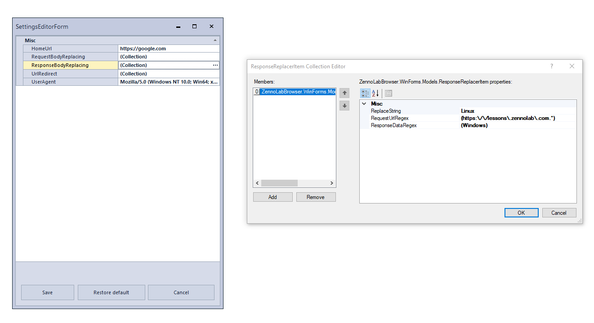

# ZennoLab Darknet Browser

Этот проект является реализацией тестового задания. Представляет из себя браузер на основе CefSharp и Windows Forms + DevExpress. 

[Скачать для теста можно тут.](https://github.com/ExtremeDotneting/ZennoLabTestBrowser/releases/tag/Release1)

Что он умеет:
- блокировать страницы (редирект);
- заменять текстовые данные в запросе проверяя при помощи регулярного выражения url и сами данные;
- заменять текстовые данные в ответе, тоже по регулярному выражению.

Все это можно задать в настройках:

